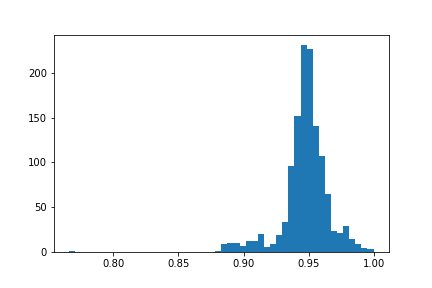
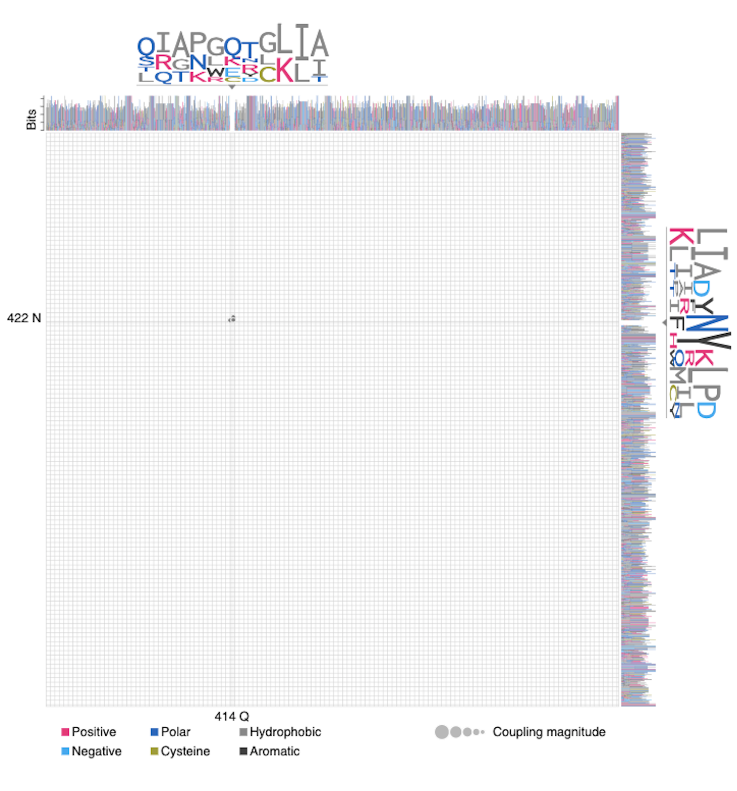

# covid19-S-Protein
This analysis runs multiple sequence analysis followed by EVCouplings to determine co-varying amino acid pairs.

Currently, the S protein is taken from NCBI along with approximately 600 Sars-Cov2 genomes sequences from GISAID. Due to privacy, the sequences themselves will not be here but can be downloaded from their site upon making an account.

### Conservation (of most common amino acid) across residues histogram]

### To run the server for EVZoom, go to the folder (currently figures/EVzoom) and type
`python -m http.server 8000` for python3  
or `python -m SimpleHTTPServer 8000` for python2  
https://github.com/debbiemarkslab/EVzoom
then navigate to http://localhost:8000/example/sars_cov2_S_protein.html

#### Sample of EVzoom snapshot

### To Do:
- Generate potentiall most impactful glycan list (currently can be seen in figures, but not in a text file)
- Run with the current number of sequenced strains
- Use other betacoronaviruses in the alignment to see if there are consistencies across the two, and if certain amino acid pairs changed that could lead to a functional/structural difference.
