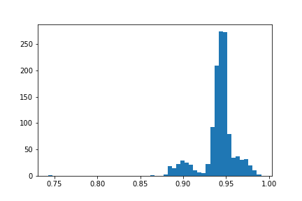
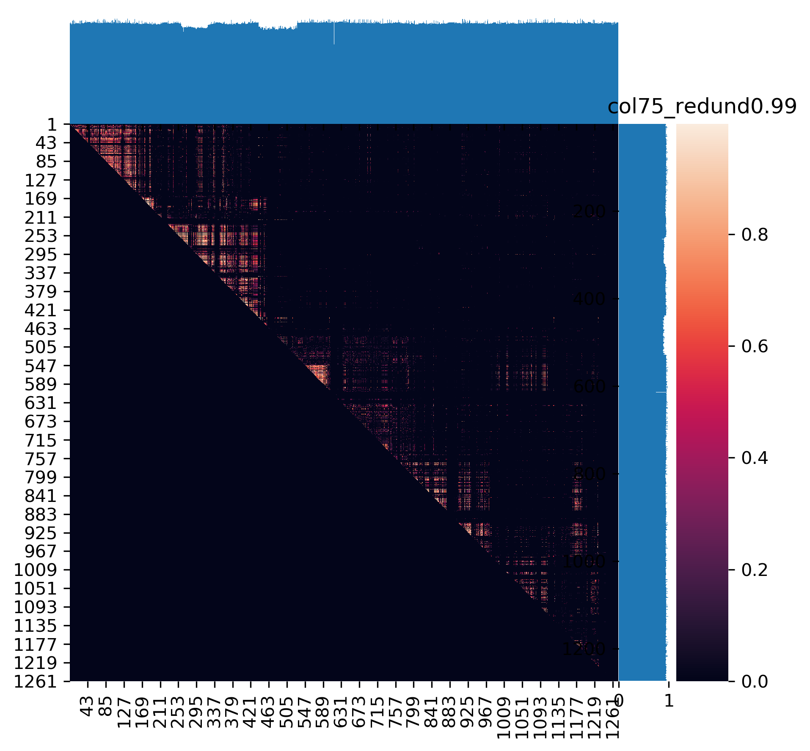
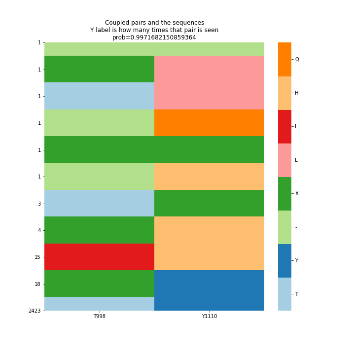
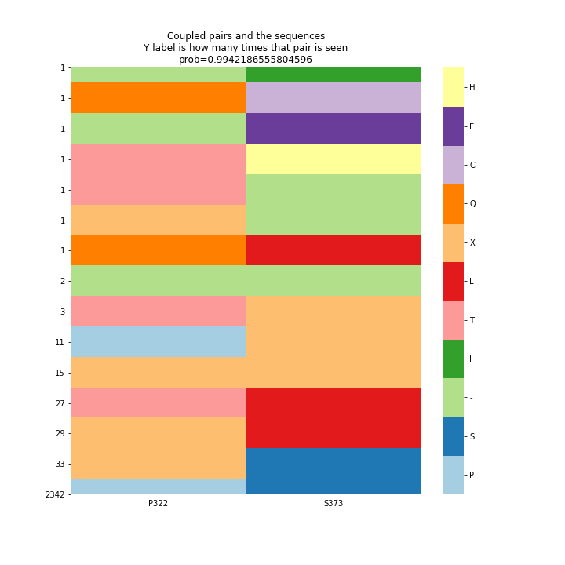
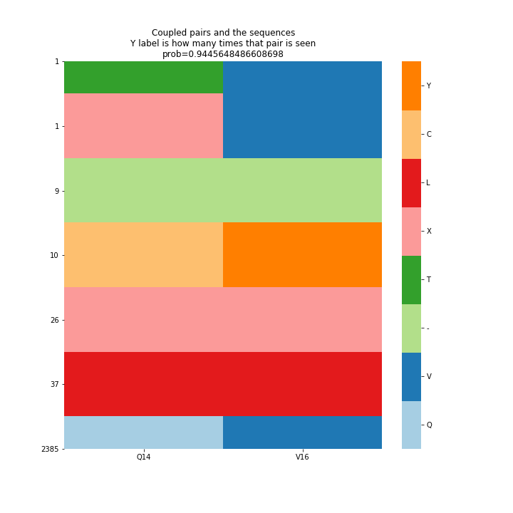
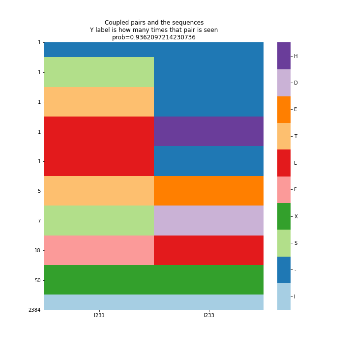
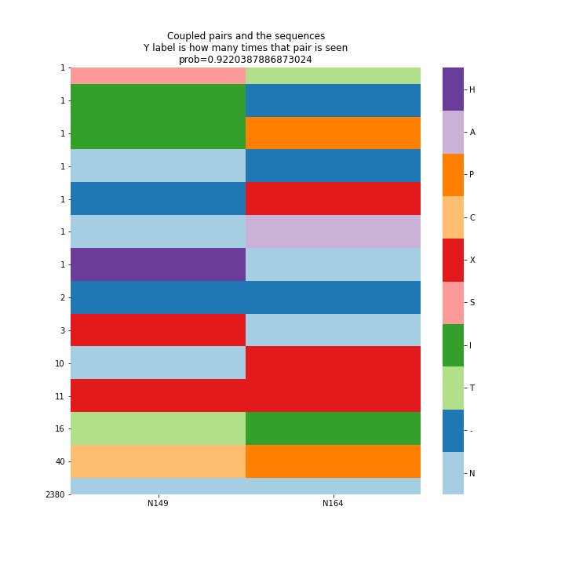

# covid19-S-Protein
This analysis runs multiple sequence analysis followed by EVCouplings (https://github.com/debbiemarkslab/EVcouplings) to determine co-varying amino acid pairs.

Currently, the S protein is taken from NCBI along with about 2900 Sars-Cov2 genomes sequences from GISAID. Due to privacy, the sequences themselves will not be here but can be downloaded from their site upon making an account.

This will be updated as new data becomes available and if any changes to the methods.

Current results will be in results folder. Raw data cannot 
Old versions might be removed, but if interested you can reach out to isshamie@ucsd.edu for those.

## Deliverables:
- The highest coupling scores have there amino-acid co-occurences plotted.
- Similarly, the highest scores for either glycosites, or adjacent glycosites (+/- 3 aas) are plotted. 
- The coupling scores (and associated probabilities), along with a way to view the results using EVZoom.
- Conservation score for each residue, using the NCBI protein as the reference.

### Current parameters of note:
- Any sequence <29kb is removed. One parameter that might be required
- One bat sequence and 9 pangolin sequences are included, so some of the signal will be from the changes of those sequences. This will be changed in a later release. 
- For some of the sequences, the local alignment done initially to map the Spike protein to each genome had some sequences (~200) that did not align well (the size varied). Those positions were filtered out due to not enough sequence coverage at that position, but may influence some of the results. See the notebook `1.2 - Pipeline - Sars-Cov2 - S protein - Couplings-Check Sequence Output.ipynb` for more information.

### Coming soon..
- The animal viruses will be removed
- The local alignment will be replaced by an alignment from a colleague. From these, very few had gaps, and there was one sequence with 1272, and one with 1270, along with <5 sequences that were smaller and removed.
- Some amino acids are labelled 'X' which is arbitrary aa. I need to look into why I am getting those- is it due to the genome sequences from GISAID, or something downstream?
- Overlay the domain region with the plots.
### 

### Pairwise matrix of probability scores of coupling. Bar is probability (0-1). Marginal probabilities are conservation score (they are symmetric, the plotting may distort the shape slightly)

### Top overall coupling pairs

### Top pairs either across glycosites, or nearby sites.

### To run the server for EVZoom, go to the folder (currently figures/EVzoom) and type
`python -m http.server 8000` for python3  
or `python -m SimpleHTTPServer 8000` for python2  
https://github.com/debbiemarkslab/EVzoom
then navigate to http://localhost:8000/example/sars_cov2_S_protein.html

<!--  -->

